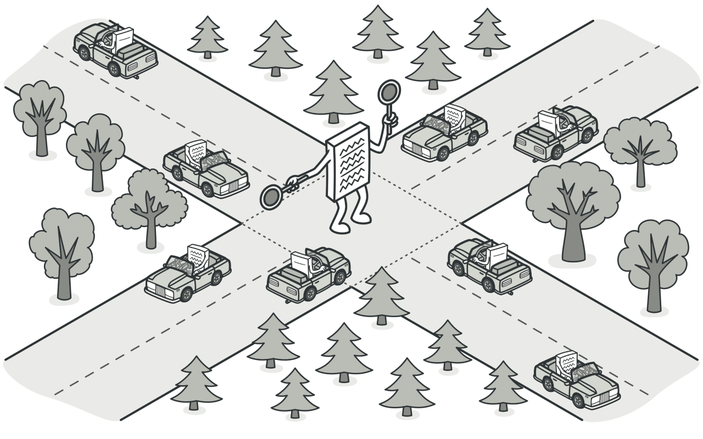
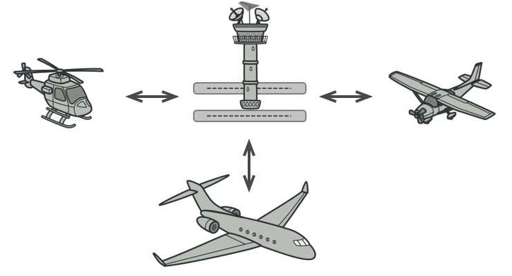
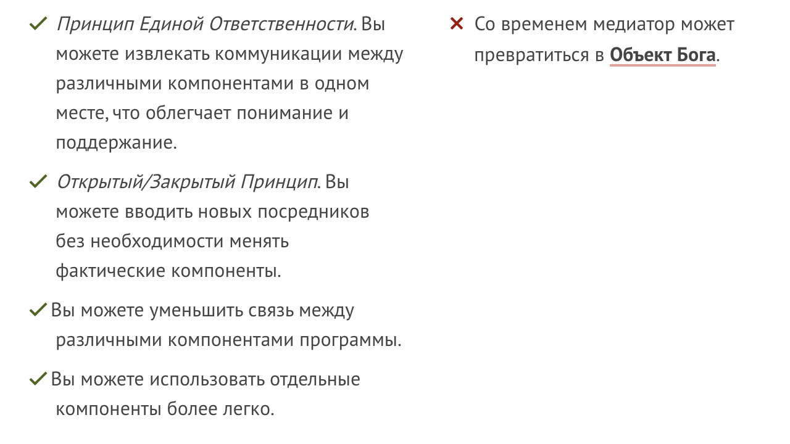

# Mediator (Посредник)

Посредник - Позволяет уменьшить хаотичные зависимости между объектами. Этот паттерн не разрешает прямые связи между объектами, заставляет их взаимодействовать через объект-посредник.

## ☹️ Проблема 

Летчики созваниваются между собой узнавая кто где летит, получается бы несуразица много лишней инфы для летчика, он отвлекается думает просчитывая маршрут, случается много катастроф. Летать не безопасно.

## 😀 Решение

Самолеты начинают связываются с вышкой которая говорит им как лететь, эта вышка -- посредник. Они перекладывают всю ответственность на вышку она думает. 

Итог: кастостроф почти нет.

## Когда использовать?
Когда есть циклические зависимости, когда связи в проекте стали громозкими и хаотичными

## Плюсы и минусы

# Как реализовать
1. Определите группу тесно связанных классов, которые выиграли бы от того, чтобы быть более независимыми (например, для более легкого обслуживания или более простого повторного использования этих классов).

2. Объявить интерфейс медиатора и описать желаемый протокол связи между медиаторами и различными компонентами. В большинстве случаев достаточно единого способа получения уведомлений от компонентов.

3. Этот интерфейс имеет решающее значение, когда вы хотите повторно использовать классы компонентов в разных контекстах. Пока компонент работает со своим посредником через общий интерфейс, можно связать компонент с другой реализацией медиатора.

4. Реализовать класс конкретного посредника. Подумайте о хранении ссылок на все компоненты внутри медиатора. Таким образом, вы можете вызвать любой компонент из методов посредника.

5. Можно пойти еще дальше и сделать посредника ответственным за создание и уничтожение составляющих объектов. После этого медиатор может напоминать а завод или фасад.

6. Компоненты должны хранить ссылку на объект посредника. Связь обычно устанавливается в конструкторе компонентов, где в качестве аргумента передаётся объект-посредник.

7. Измените код complements’ так, чтобы они вызывали метод уведомлений медиатора вместо методов на других компонентах. Извлеките код, который включает вызов других компонентов в класс медиатора. Выполняйте этот код всякий раз, когда посредник получает уведомления от этого компонента.