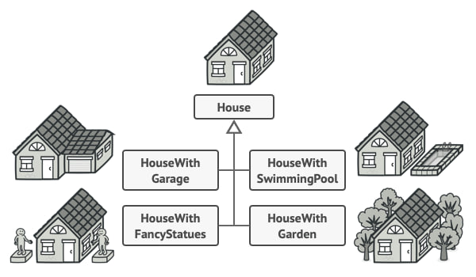

# Builder (Строитель)

Builder - это паттерн проектирования, позволяющий создавать сложные объекты шаг за шагом. Паттерн позволяет создавать разные варианты одного объекта, используя один и тот же код.


## Проблема:

Реализацию некоторых объектов проблематично уместить в конструкторе
(Использовать когда объект разрастается)

<br>
<span style="font-size:10px;">Вы можете сделать программу слишком сложной, создав подкласс для каждой реализации</span>

Шаблон Builder предполагает, что вы извлекаете код построения объекта из своего собственного класса и перемещаете его в отдельные объекты, называемые *строители*.

<br>
<span style="font-size:10px;">Шаблон Builder позволяет создавать сложные объекты шаг за шагом.</span>

## Директор

Вы можете создать отдельный класс, который определяет, как строить объект, и другой класс, который делает это построение.


Класс директора не обязателен, но он помогает повторно использовать код и скрывает детали построения от клиента.

## Пример

```javascript
class Car {
  constructor() {
    this.autoPilot = false;
    this.parktronic = false;
    this.signaling = false;
  }
}
```

```javascript
class CarBuilder {
  constructor() {
    this.car = new Car();
  }

  addAutoPilot(autoPilot) {
    this.car.autoPilot = autoPilot;
    return this;
  }

  addParktronic(parktronic) {
    this.car.parktronic = parktronic;
    return this;
  }

  addSignaling(signaling) {
    this.car.signaling = signaling;
    return this;
  }
  updateEngine(engine) {
    this.car.engine = engine;
    return this;
  }

  build() {
    return this.car;
  }
}
```

```javascript
const MyTesla = new CarBuilder()
  .addAutoPilot(true)
  .addParktronic(true)
  .updateEngine("V8")
  .build();

console.log(MyTesla);
```

## Структура


### Псевдокод


## Плюсы / Минусы


