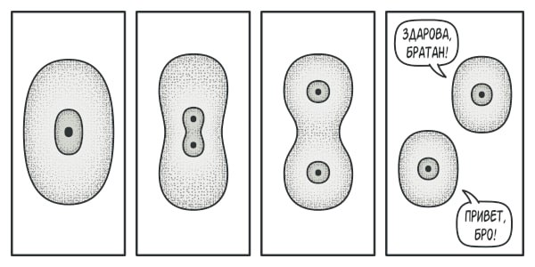

# Prototype (Прототип)

У вас есть объект, который нужно скопировать. Для этого создайте новый пустой объект того же класса и поочередно скопируйте значения его полей.

Но есть нюанс: не все объекты можно скопировать таким образом, поскольку некоторые поля могут быть приватными и недоступны для копирования.


Этот паттерн реализует создание клона объекта с использованием логики, заложенной в объекте/классе.<br>
То есть копирование функцией `structuredClone()` это не реализация паттерна.

## Решение

Паттерн Прототип поручает создание копий самим копируемым объектам
Объект, который копируют, называется *прототипом* (откуда и название паттерна).



_Примеры:_

```javascript
class TeslaCar {

	constructor(model, price, interior, autopilot) {
		this.model = model;
		this.price = price;
		this.interior = interior;
		this.autopilot = autopilot;
	}

	produce() {
		return new TeslaCar(this.model, this.price, this.interior, this.autopilot);
	}
}

const prototypeCar = new TeslaCar('S', 90000, 'black', false)
const car1 = prototypeCar.produce();
const car2 = prototypeCar.produce();
const car3 = prototypeCar.produce();

const car1.interior = "white"
const car2.autopilot = true
```

```javascript
const prototypeCar = {
  brand: "Toyota",
  model: "Corolla",
  drive() {
    console.log(`Driving ${this.brand} ${this.model}`);
  },
  clone() {
    return Object.create(this);
  },
};

const myCar = prototypeCar.clone();
myCar.brand = "Honda"; // Изменяем свойство в клоне
myCar.model = "Civic"; // Изменяем другое свойство
```
