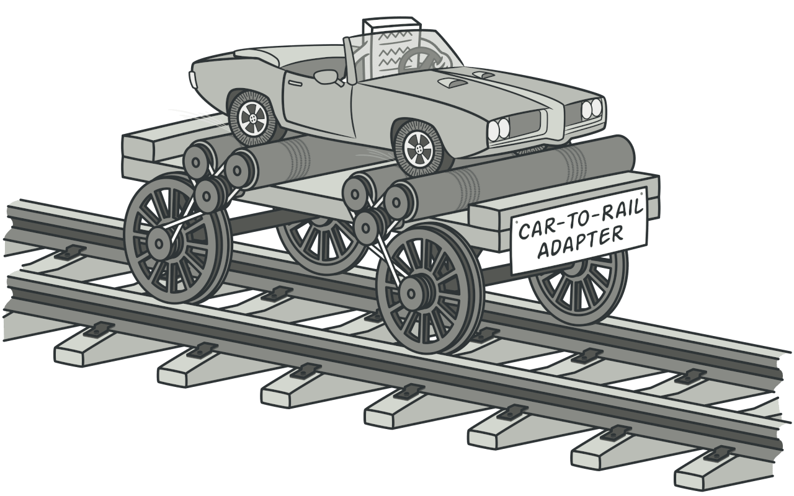
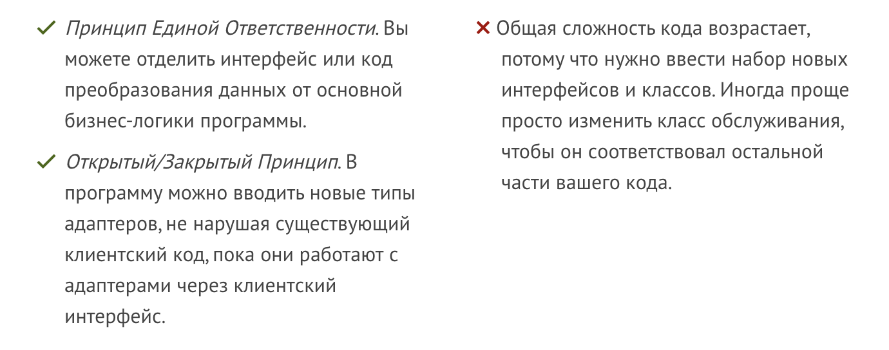

# Adapter (Адаптер)

Позволяет взаимодействовать объектам с несовместимыми интерфейсами.



## ☹️ Проблема (реальный пример)

Какой-то разработчик сделал до тебя компонент `Dropdown`, он принимает данные в странном неудобном виде. <br>
С сервера приходят данные:<br>

```javascript
export const SORT_DATA: SortItem[] = [
  {
    label: "Без фильтра",
    value: "default",
  },
  {
    label: "Сначала дешевле",
    value: "byAscPrice",
  },

  {
    label: "Сначала дороже",
    value: "byDescPrice",
  },
];
```

<br>

Компонент требует данные в таком виде:

```javascript
[
  {
    label: {
      text: {
        string: "Без фильтра",
      },
    },
    value: {
      text: {
        string: "default",
      },
    },
  },
  {
    label: {
      text: {
        string: "Сначала дешевле",
      },
    },
    value: {
      text: {
        string: "byAscPrice",
      },
    },
  },

  {
    label: {
      text: {
        string: "Сначала дешевле",
      },
    },
    value: {
      text: {
        string: "byDescPrice",
      },
    },
  },
];
```

Ты не можешь поменять логику компонента `Dropdown` это займет слишком много времени, `Dropdown` и слишком много логики внутри менять.

## 😀 Решение

Написать простой адаптер к компоненту чтобы его можно было бы легко использовать.

```javascript
const adapterSortData = (sortData) =>
  sortData.map((item) => ({
    label: {
      text: {
        string: item.label,
      },
    },
    value: {
      text: {
        string: item.value,
      },
    },
  }));
```

## Плюсы и минусы



## Примеры
