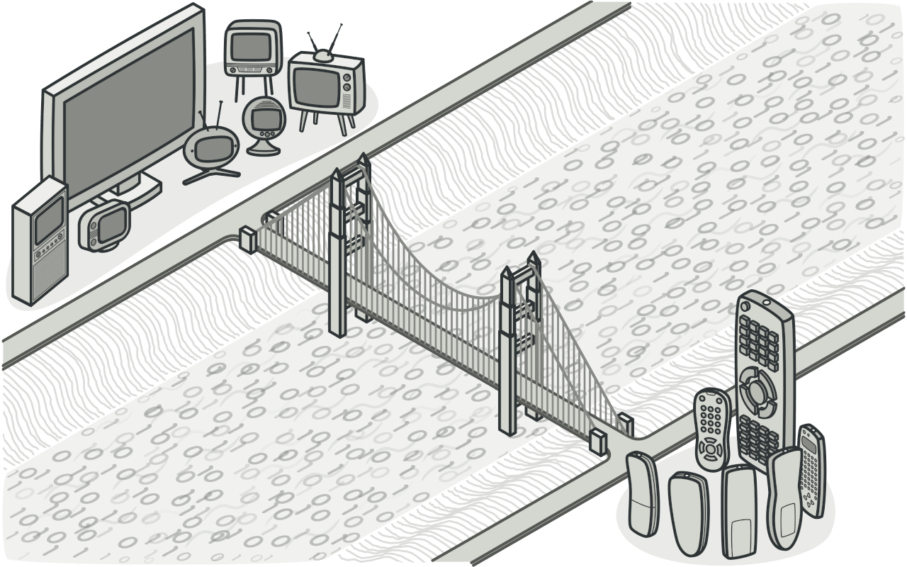
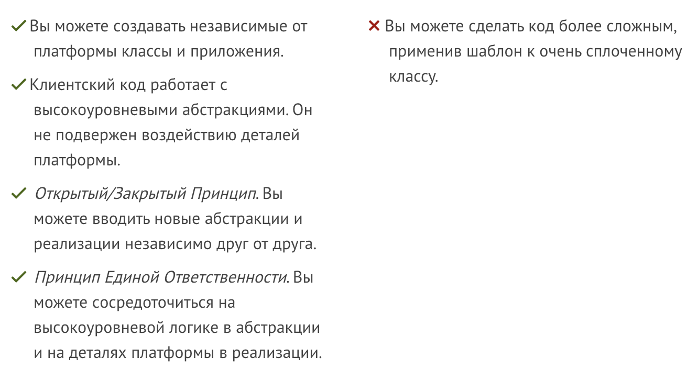

# Bridge (Мост)

Bridge (или "Мост") — это способ организации кода, который помогает разделить абстракцию и реализацию, чтобы их можно было развивать независимо друг от друга. Давайте разберем на простом примере.



▎Абстракция

Выделение общих характеристик объектов и скрытие деталей реализации. Это позволяет сосредоточиться на том, что делает объект, а не как он это делает.

_**Пример:**_ Интерфейс `IVehicle` с методами `Start()` и `Stop()`, не указывая, как именно они работают.

▎Реализация

Конкретный способ выполнения абстракции. Разные классы могут реализовать один и тот же интерфейс по-разному.

_**Пример:**_ Классы `Car` и `Bicycle` реализуют `IVehicle`, но их методы `Start()` и `Stop()` работают по-разному.


## Проблема
Представьте, что у вас есть разные типы устройств: `телевизоры` и `компьютеры`. <br>У каждого из них может быть несколько типов управления: `дистанционный пульт` или `приложение на телефоне`.

## Решение
Вместо того, чтобы создавать множество классов, например, `ТелевизорСПультом`, `ТелевизорСПриложением`, `КомпьютерСПультом`, `КомпьютерСПриложением`, вы создаете абстракцию управления и устройства отдельно. 

Устройство будет отдельным классом.<br>
Способ управленияx тоже будет отдельным классом.<br>
С помощью этого паттерна вы сможете легко добавлять новые способы управления или новые устройства, не изменяя существующий код. Это делает систему более гибкой и упрощает добавление новых функций. 

Таким образом, мост позволяет вам сосредоточиться на характеристиках устройства и способах управления отдельно, без дублирования кода.


## Пример
#### Определим устройство
``` python
class Television:
    def turn_on(self):
        print("Телевизор включен")

    def turn_off(self):
        print("Телевизор выключен")
```

#### Определим пульт управления
``` python
class RemoteControl:
    def __init__(self, device):
        self.device = device

    def press_power_button(self):
        self.device.turn_on()
```


#### Использование
```python
tv = Television()

# Создаем пульт управления для телевизора
remote = RemoteControl(tv)

# Нажимаем кнопку включения
remote.press_power_button()  # Вывод: Телевизор включен
```


## Плюсы и минусы


