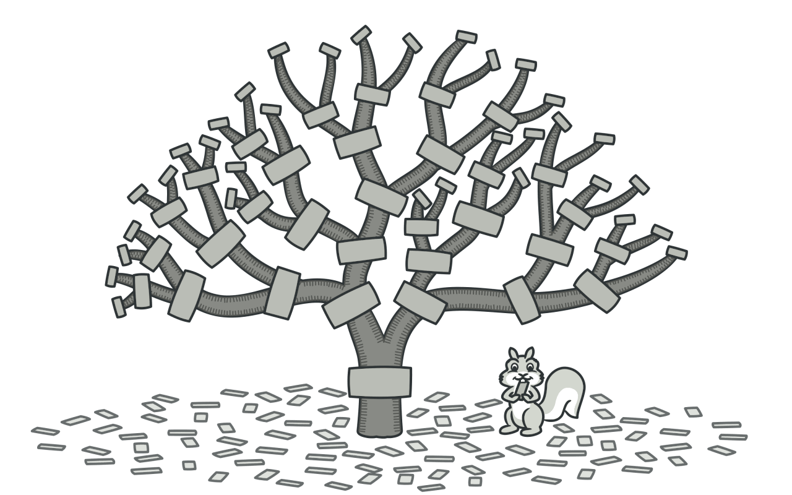
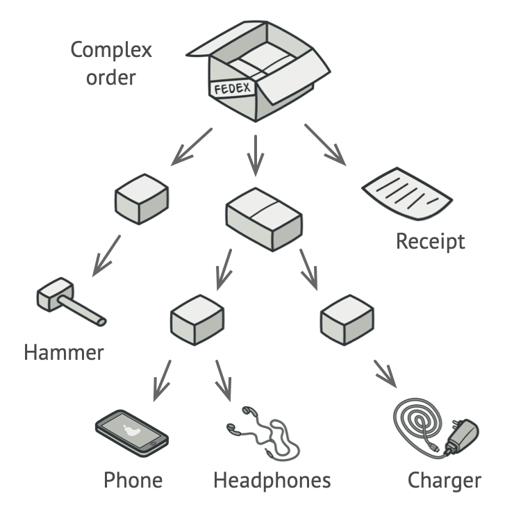
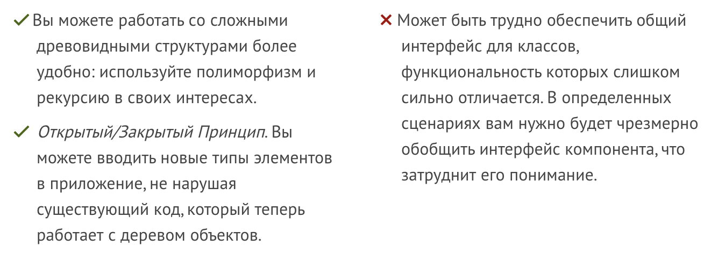

# Composite (Составной)

Композит - это способ объединять объекты в группы. Эти группы можно использовать так же, как и отдельные объекты.

Представьте, что у вас есть коллекция геометрических фигур - кругов, квадратов, треугольников. Используя "Композит", вы можете собрать эти фигуры в группы.

Теперь вы можете делать с этими группами то же самое, что и с отдельными фигурами. Например, вы можете:

- Переместить всю группу фигур в другое место
- Увеличить или уменьшить размер всей группы
- Изменить цвет всех фигур в группе

## ☹️ Проблема 

Композитный шаблон полезен, если вашу модель данных можно представить как дерево. (FSD)

Представьте два типа объектов: продукты и коробки. Коробка может содержать продукты или другие коробки. Эти меньшие коробки тоже могут содержать продукты или ещё более маленькие коробки, и так далее.

Допустим, вы создаёте систему для обработки заказов. Заказ может включать простые продукты или коробки, в которых находятся продукты и другие коробки. Как посчитать общую стоимость такого заказа?

Вы могли бы попытаться вручную разворачивать все коробки и пересчитывать продукты. В реальной жизни это возможно, но в программе это намного сложнее. Нужно учитывать классы продуктов и коробок, уровни вложенности и другие мелочи, что делает такой подход слишком сложным или неудобным.

## 😀 Решение

Composite работает с продуктами и коробками через общий интерфейс с методом для расчета цены.

Как он работает? Для продукта метод просто возвращает его цену. Для коробки метод суммирует цены всех предметов внутри неё. Если внутри есть другая коробка, она тоже раскроется и посчитает цены своих содержимых. Коробка может добавить свои расходы, например, за упаковку.

Можно было бы просто распаковать все коробки и подсчитать все продукты. В реальности это возможно, но в программе не так просто учесть вложенность коробок и классы, с которыми работаешь. Такой прямой подход оказывается громоздким или даже невозможным.

## Примеры
Компонент меню и подпунктов меню: Основное меню может содержать как одиночные пункты, так и вложенные подменю.

Пример: `<Menu>` может содержать как `<MenuItem>`, так и `<SubMenu>`, которые в свою очередь содержат другие `<MenuItem>`.

**Props `<Menu>`, влияющие на `<MenuItem>`:_**
Активное состояние (active item):

Props в `<Menu>`: `setActiveItem(itemId)`
Что делает: Устанавливает активный элемент меню. Все` <MenuItem>` проверяют, является ли они активными, и обновляют своё состояние соответственно.
Влияние на `<MenuItem>` Активный элемент визуально выделяется (например, цветом или подчеркиванием).
Выбор пункта меню:

Метод в <Menu>: selectItem(itemId)
Что делает: Позволяет выбрать пункт меню. После выбора обновляется состояние в <Menu>, а <MenuItem> изменяет своё состояние на "выбранный".
Влияние на <MenuItem>: Один или несколько элементов могут быть отмечены как выбранные.

## Плюсы и минусы

