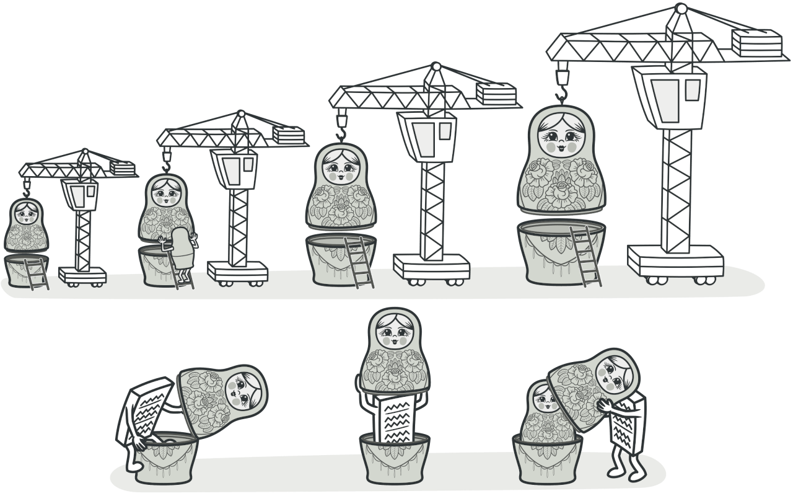

# Decorator (Деккоратор)

Декоратор - структура оборачивающая существующую класс/функцию и расширяющаяя их функциональность. (не изменяет, а расширяет)

Декоратор - это способ добавить новые возможности к объекту, не меняя его исходный код. Это делается путем создания специального объекта-обертки, который содержит новые возможности и оборачивает исходный объект.
Если вспомнить в JS существуют <a href="https://learn.javascript.ru/call-apply-decorators">функции-декораторы</a> 🤔 




## ☹️ Проблема 

Представим, что у нас есть чистая функции `slow1(x)`, `slow2(x)`, выполняющие ресурсоёмкие вычисления. <br>
Эта функция вызывается часто, и мы хотим кешировать (запоминать) возвращаемые ею результаты, чтобы сэкономить время на повторных вычислениях.

``` javascript
function slow1(x) {
  // здесь могут быть ресурсоёмкие вычисления
  alert(`Called with ${x}`);
  return x;
}

function slow2(x) {
  // здесь могут быть ресурсоёмкие вычисления
  alert(`Called with ${x}`);
  return x;
}
```

Не ужели прийдется влазить в эти огромные функцию и менять функционал?


## 😀 Решение

Вместо того, чтобы усложнять функции slow1(x), slow2(x) дополнительной функциональностью, мы можем обернуть их деккоратором и кэшировать значения.

``` javascript
function cachingDecorator(func) {
  let cache = new Map();

  return function(x) {
    if (cache.has(x)) {    // если кеш содержит такой x,
      return cache.get(x); // читаем из него результат
    }

    let result = func(x); // иначе, вызываем функцию

    cache.set(x, result); // и кешируем (запоминаем) результат
    return result;
  };
}

slow = cachingDecorator(slow);

alert( slow1(1) ); // slow(1) кешируем
alert( "Again: " + slow(1) ); // возвращаем из кеша

alert( slow1(2) ); // slow(2) кешируем
alert( "Again: " + slow(2) ); // возвращаем из кеша

alert( slow2(43) ); // slow(43) кешируем
alert( "Again: " + slow(43) ); // возвращаем из кеша
```
