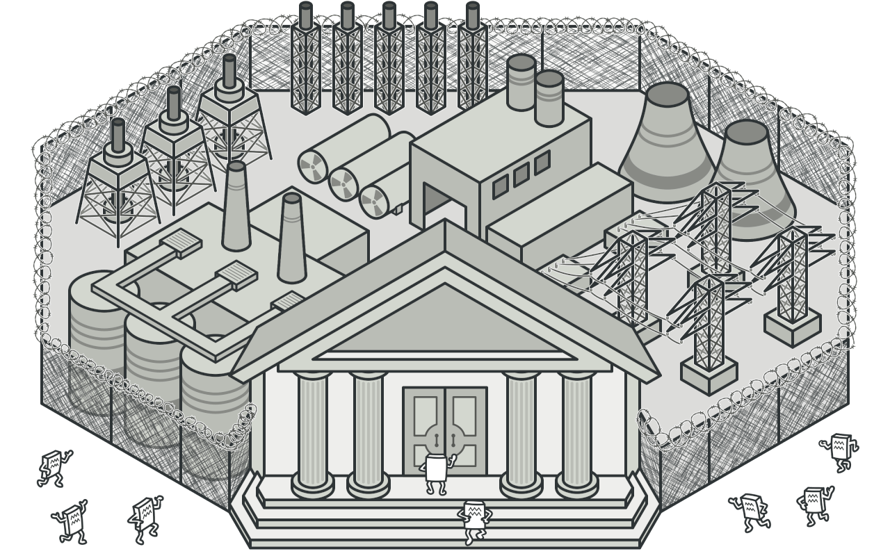
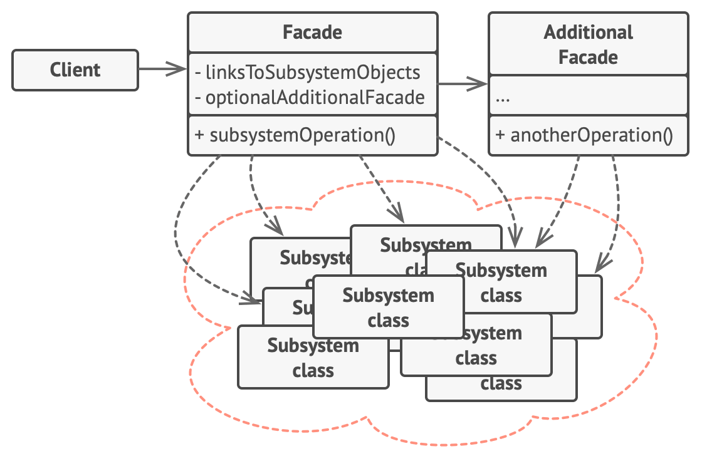

# Facade (Фасад) 

Задача фасада объединить сложные структуры и выдать удобный интерфейс взаимодействия с ними.

## ☹️ Проблема 

Допустим, у вас есть сложный код, который работает с множеством объектов из сторонней библиотеки. Чтобы все работало, вам нужно инициализировать объекты, выполнять методы в правильном порядке и т. д. Это делает ваш код сложным и трудным для понимания.

## 😀 Решение

Фасад - это класс, который упрощает работу с сложной системой. Он предоставляет только необходимые функции, чтобы сделать работу проще. Это полезно, когда вам нужно использовать сложную библиотеку, но вам нужна только часть ее функциональности.

## Структура

## Примеры

1. Компонент `<Slider/>` содержащий в себе много логики библиотеки `swiper` это --- фасад
