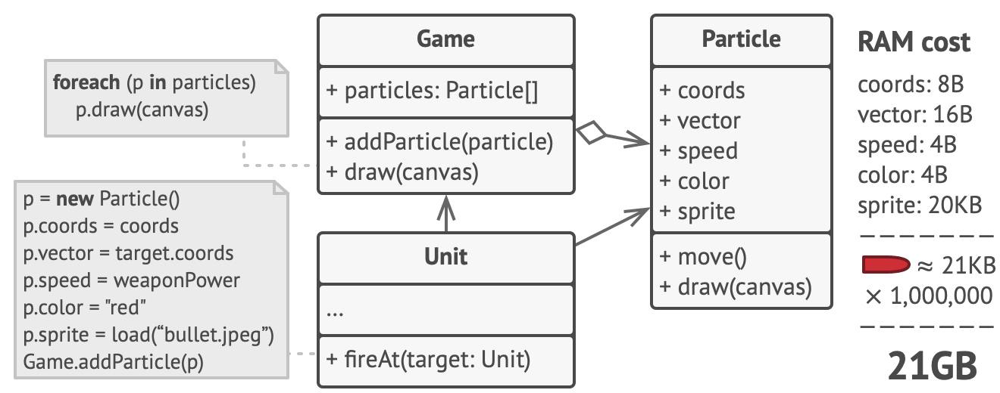
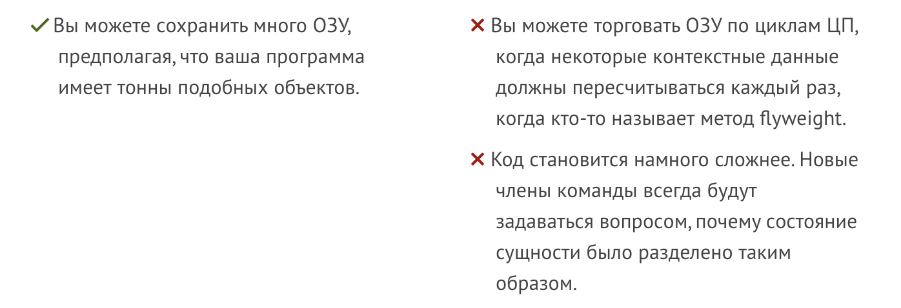

# Flyweight (Легковес | Кеш | Приспособленец)

Flyweight — это паттерн проектирования, который помогает экономить память, позволяя нескольким объектам использовать общие данные вместо хранения этой информации в каждом объекте. Это позволяет создавать больше объектов, не занимая при этом много оперативной памяти.

## ☹️ Проблема 

Для развлечения после работы вы решили создать простую видеоигру, где игроки перемещаются по карте и стреляют друг в друга. Вы внедрили реалистичную систему частиц, чтобы добавить зрелищности: пули, ракеты и осколки взрывов.

Когда вы завершили игру и отправили ее другу для тестирования, она отлично работала на вашем пк, но на его компе часто вылетала из-за нехватки оперативной памяти. После долгих попыток разобраться в проблеме, вы поняли, что причина — это ваша система частиц: каждый элемент (пуля, ракета, осколок) был отдельным объектом с большим объемом данных. Когда на экране появлялось слишком много частиц, игра не могла использовать оставшуюся память и вылетала.

Если внимательно посмотреть на класс `Particle`, то можно увидеть, что поля цвета и спрайта занимают много памяти, хотя они хранят одинаковые данные для всех частиц. Например, все пули имеют один и тот же цвет и спрайт.

Другие данные, такие как координаты и скорость, уникальны для каждой частицы и постоянно меняются. Эти стабильные данные называют внутренним состоянием, которое нельзя изменить, в то время как изменяемые данные — это внешнее состояние.

## 😀 Решение

Создать отдельный класс для внешнего вида пуль и для перемещения.
Во время вызова перемещения оно будет ссылаться на уже существующий внешний вид пули.

## Что должен включать в себя легковес:
1. Фабрика управляет созданием объектов:

   - Используй фабрику для создания и управления объектами Flyweight.
   - Фабрика проверяет, был ли уже создан объект с определенным состоянием, и возвращает существующий объект, если он уже есть. Новый объект создается только при необходимости.

2. Разделение состояния:

   - Внутреннее состояние (shared) — это часть данных, которая общая для многих объектов. Например, семейство шрифта ("Arial"). Это состояние хранится в самом объекте Flyweight и не меняется.
   - Внешнее состояние (unshared) — это часть данных, которая уникальна для каждого объекта или его использования. Например, цвет или размер шрифта. Это состояние передается извне и не хранится в самом объекте Flyweight.

3. Минимизация количества объектов:

   - Цель Flyweight — уменьшить количество создаваемых объектов за счет их повторного использования. Это помогает сэкономить память, особенно если множество объектов имеют схожие данные.

## Когда использовать?

Когда есть необходимость:
- Не создавать одинаковых обьектов 
- Переиспользовать одинаковые данные внутри обьектов

## Плюсы и минусы

## Примеры
- <a href="./examples/flyweight-classic.ts">Класическая реализация полностью соотвествующая определению</a>
- <a href="./examples/flyweight.ts">Более упрощенная которую всегда тоже называют Flyweight</a>
