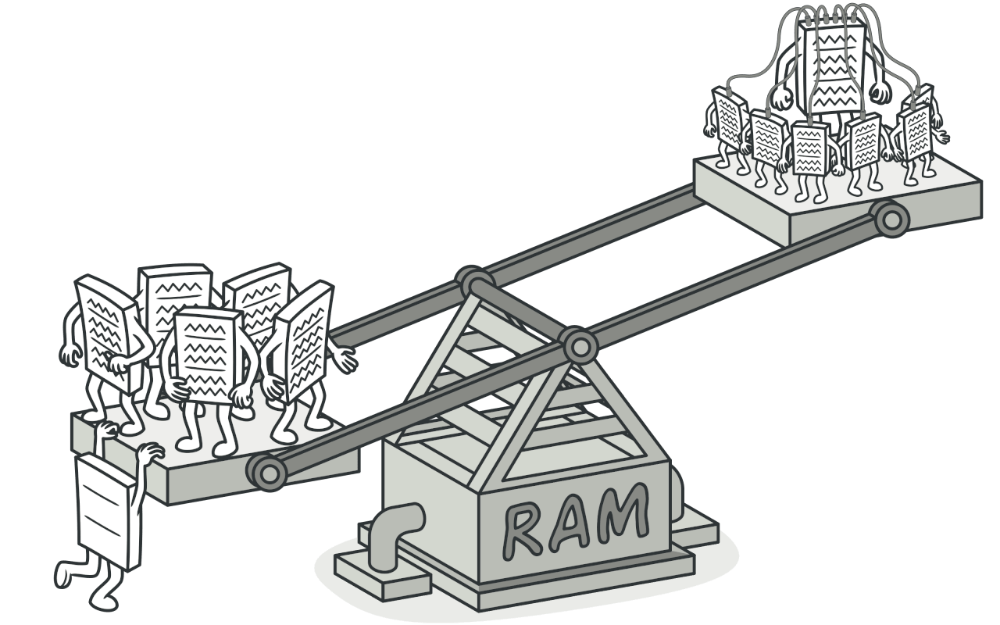
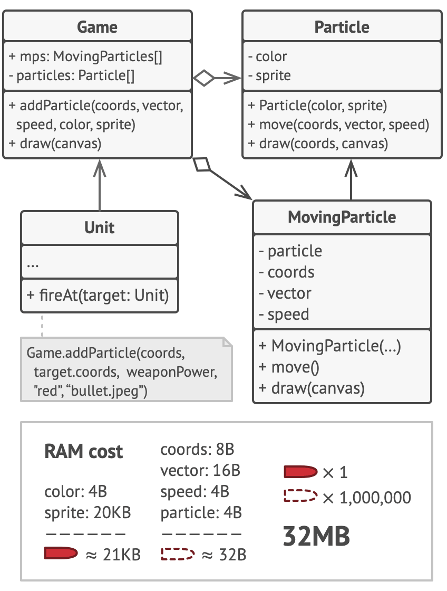
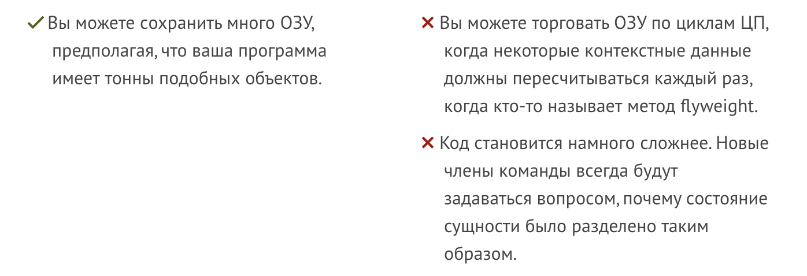

# Flyweight (Легковес | Кеш | Приспособленец)

Flyweight — это паттерн проектирования, который помогает экономить память, позволяя нескольким объектам использовать общие данные вместо хранения этой информации в каждом объекте. Это позволяет создавать больше объектов, не занимая при этом много оперативной памяти.

## ☹️ Проблема 

Для развлечения после работы вы решили создать простую видеоигру, где игроки перемещаются по карте и стреляют друг в друга. Вы внедрили реалистичную систему частиц, чтобы добавить зрелищности: пули, ракеты и осколки взрывов.

Когда вы завершили игру и отправили ее другу для тестирования, она отлично работала на вашем пк, но на его компе часто вылетала из-за нехватки оперативной памяти. После долгих попыток разобраться в проблеме, вы поняли, что причина — это ваша система частиц: каждый элемент (пуля, ракета, осколок) был отдельным объектом с большим объемом данных. Когда на экране появлялось слишком много частиц, игра не могла использовать оставшуюся память и вылетала.

Если внимательно посмотреть на класс Particle, то можно увидеть, что поля цвета и спрайта занимают много памяти, хотя они хранят одинаковые данные для всех частиц. Например, все пули имеют один и тот же цвет и спрайт.

Другие данные, такие как координаты и скорость, уникальны для каждой частицы и постоянно меняются. Эти стабильные данные называют внутренним состоянием, которое нельзя изменить, в то время как изменяемые данные — это внешнее состояние.

Паттерн Flyweight предлагает не хранить внешнее состояние внутри объекта. Вместо этого его нужно передавать методам, которые его используют. Таким образом, внутри объекта остается лишь внутреннее состояние, что позволяет в разное время использовать один и тот же объект с меньшим количеством памяти, так как различия будут только во внешнем состоянии.

## 😀 Решение

## Плюсы и минусы

## Примеры
