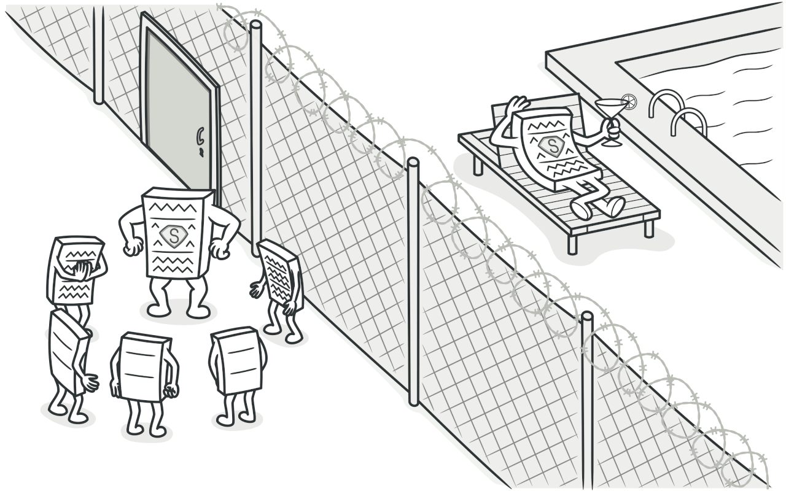
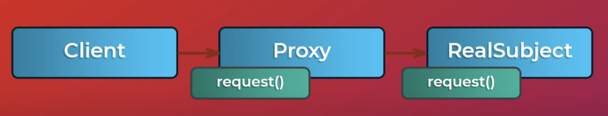
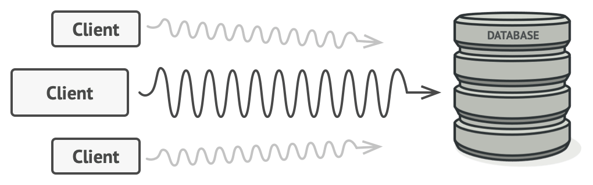
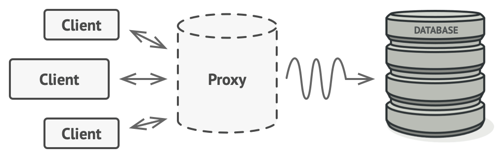

# Proxy (Заместитель)

Прокси - это структурный шаблон проектирования, который позволяет вам предоставлять замену или место для другого объекта. Прокси контролирует доступ к оригинальному объекту, позволяя вам выполнять какие-либо действия до или после того, как запрос дойдет до оригинального объекта.



## ☹️ Проблема 

Допустим сервер не пускает нас к себе из-за политики CORS. Политика CORS проверяется браузером.

## 😀 Решение

Создаем Proxy-сервер который пускает нас к себе, отсылая ему запросы, он перенаправляет их на удаленный сервер, получает ответ и отдает нам.

Proxy сервер разрешает подключатся к нему. Поэтому никаких проблем не возникает.

## Структура



## Примеры

#### 1. _Защищающий Proxy_

Оригинальный класс для открытия автомобиля <br>
``` javascript
class CarAccess {
	open() {
		console.log('Opening car door')
	}

	close() {
		console.log('Closing the car door')
	}
};
``` 

Наш Proxy <br>
``` javascript
class SecuritySystem {
	constructor(door) {
		this.door = door;
	}

	open(password) {
		if (this.authenticate(password)) {
			this.door.open();
		} else {
			console.log('Access denied!');
		}
	}

	authenticate(password) {
		return password === 'Ilon';
	}

	close() {
		this.door.close()
	}
};
``` 

Использование: <br>
``` javascript
const door = new Security System(new Car Access());

door.open('Jack'); // "Access denied!"
door.open('Ilon'); // "Opening car door"
door.close(); // "Closing the car door"
``` 


#### 2. _Кэширующий Proxy_

Допустим напрямую к БД обращаться труднозатратно, БД долго ищет данные и т.д.

<br><br>

Делаем proxy который кэширует данные и все

